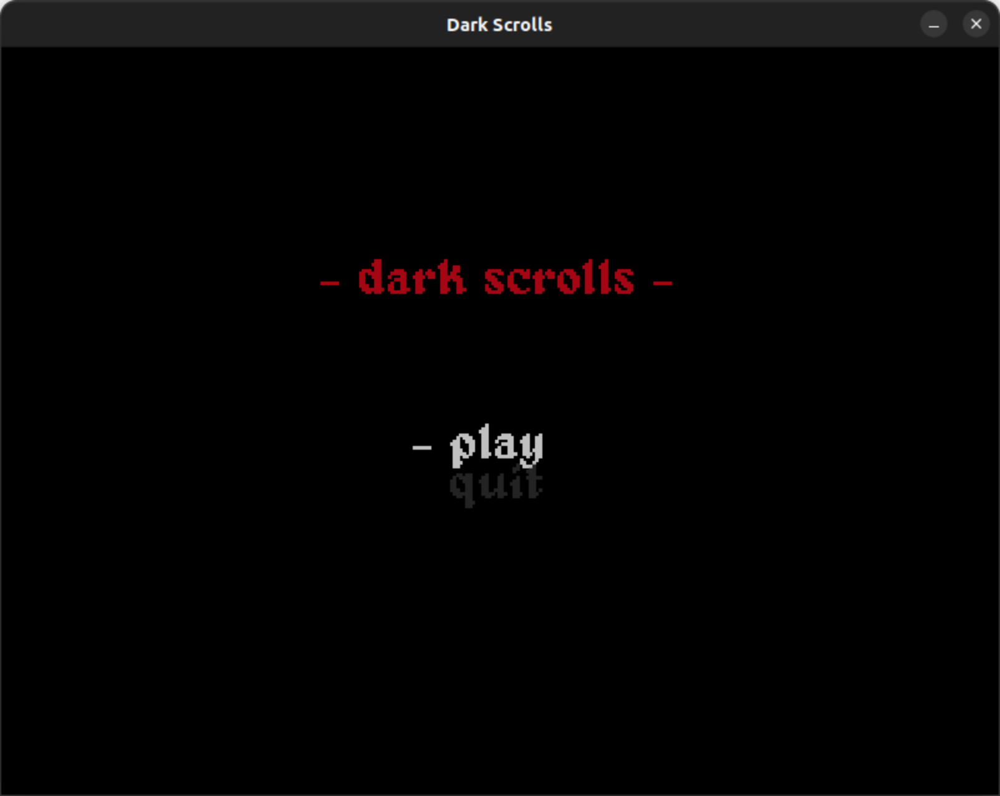
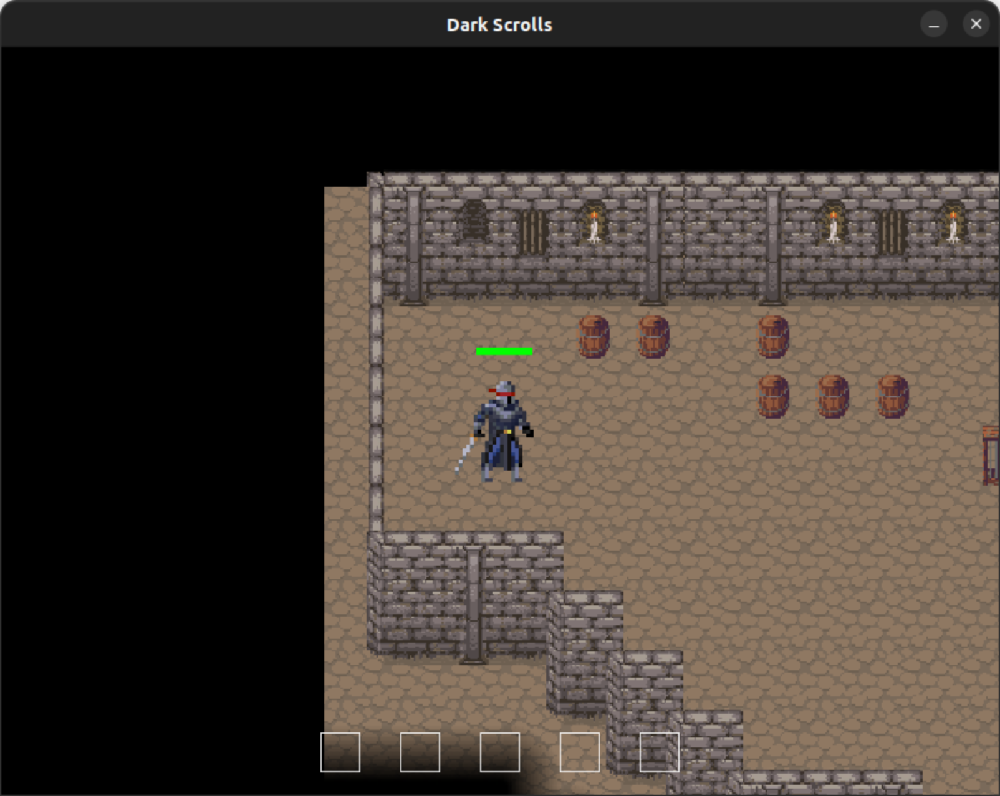
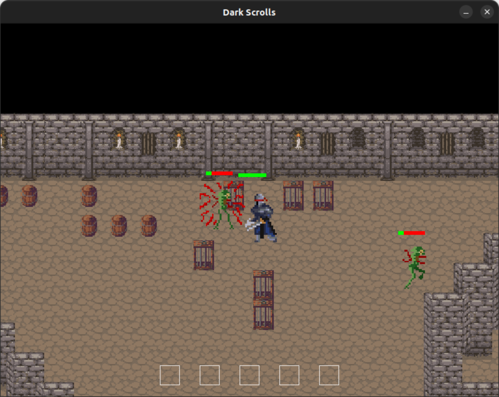
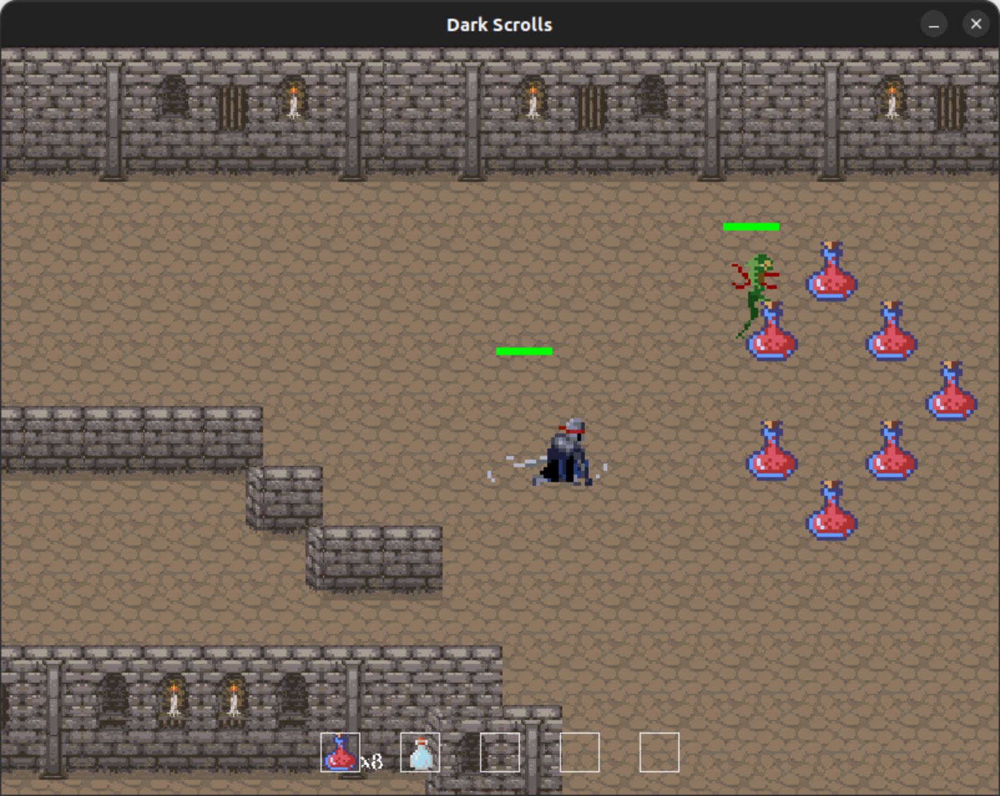
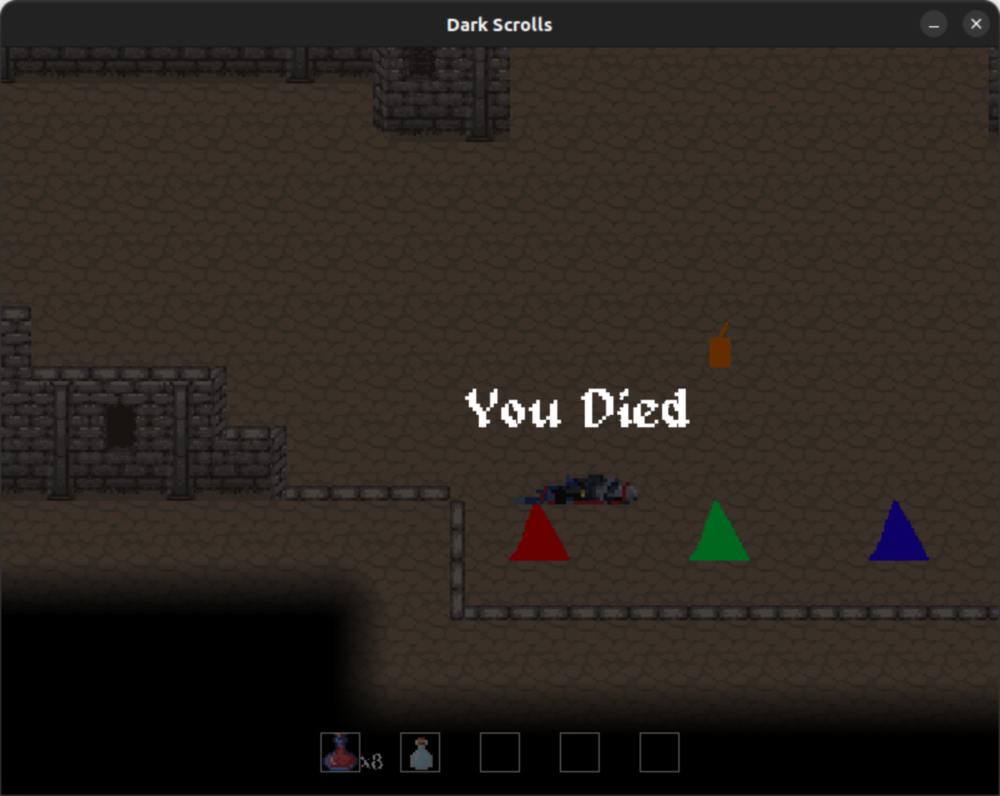

# Dark Scrolls

A top-down dungeon crawler demo, created as a project for my Video Game Design class at Colorado Mesa University. It built in collaboration with 3 other students and a graphic designer, and I was the project manager for the duration of the class.

The game engine was built from scratch in C++ and uses the SDL libary. Players can move, attack and kill enemies, and acquire potions and use spells that have various effects.

## Outcomes

This project gave me good experience in C++, low-level programming, OOP, AGILE software development principles, branches, merging, and project management. It was also a fun experiment in sprite development and sound design, creating the various assets for the game.

## How to build 

## Linux
Ensure that you have these packages installed:

```
libsdl-dev
libsdl-ttf-dev
libsdl-image-dev
libsdl-mixer-dev
```

Then simply run `make` in the root project folder to build the `dark-scrolls` executable.

## Screenshots





